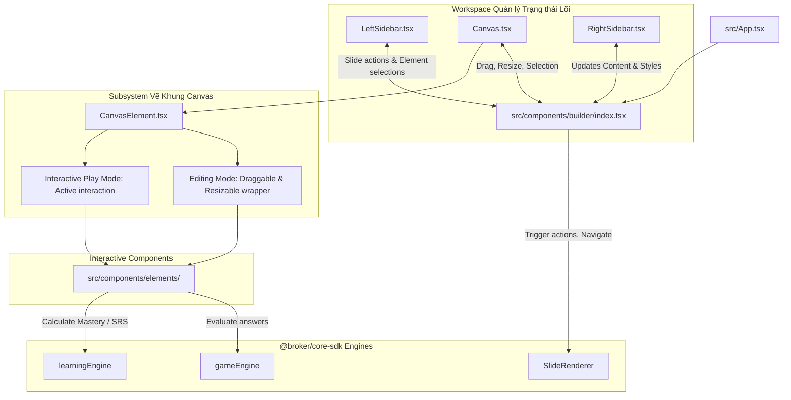

# ARCHITECTURE - Kiến trúc hệ thống và Luồng dữ liệu

Tài liệu này mô tả chi tiết kiến trúc phần mềm, cấu trúc dữ liệu, luồng tương tác và phương pháp quản lý trạng thái của ứng dụng Slide Builder & Standalone Previewer.

---

## 1. Thiết kế tổng quan hệ thống (Big-Picture Design)

Hệ thống hoạt động như một công cụ thiết kế trực quan (Visual slide-deck workspace) tích hợp công cụ giáo dục thông minh (eLearning engine) thông qua mô hình phân lớp rõ ràng:

---

## 2. Mô hình dữ liệu và Định nghĩa kiểu (Data Models & Schemas)

Hệ thống kế thừa cấu trúc dữ liệu chuẩn hóa của `@broker/core-sdk` thông qua cơ chế **Discriminated Union** nghiêm ngặt của TypeScript để đảm bảo tính an toàn dữ liệu (Type-safety):

1.  **Slide**: Định nghĩa cấu trúc của một Slide chứa danh sách các phần tử.
2.  **SlideElement**:
    *   Mỗi phần tử có các thuộc tính nền tảng: `id`, `type`, `position` (tọa độ tỷ lệ % tuyệt đối: `x`, `y`, `width`, `height`), `style`, `enterAnimation`, `exitAnimation`, `actions`.
    *   Thuộc tính `data` được ép kiểu chính xác thông qua giá trị của `type`:
        *   `type: "TEXT"` ➔ `data: TextData` (`content`)
        *   `type: "VIDEO"` ➔ `data: VideoData` (`src`, `poster`)
        *   `type: "QUIZ"` ➔ `data: MultipleChoiceData` (`question`, `options`, `correctId`)
        *   `type: "SORTING"` ➔ `data: SortingData` (`items`, `correctOrder`)
        *   `type: "MATCHING"` ➔ `data: MatchingData` (`leftColumn`, `rightColumn`, `correctPairs`)
        *   `type: "HOTSPOT"` ➔ `data: HotspotData` (`imageUri`, `zones`, `correctZoneId`)
3.  **ElementAction**:
    *   Định nghĩa một hành động tương tác gắn với phần tử. Gồm `trigger` (`ON_CLICK`, `ON_DOUBLE_CLICK`, `ON_HOVER`, `ON_ENTER_VIEWPORT`), `type` (`NAVIGATE_SLIDE`, `TOGGLE_VISIBILITY`, `PLAY_MEDIA`, `EVALUATE_ANSWER`) và `payload` tương thích tuyệt đối thông qua kiểu ánh xạ `ActionPayloadMap`.

---

## 3. Quản lý trạng thái (State Management Strategy)

Ứng dụng sử dụng kiến trúc luồng dữ liệu một chiều (Unidirectional Data Flow) của React:

*   **State Lõi nằm tập trung (Single Source of Truth)**:
    *   Toàn bộ trạng thái của danh sách slide (`slides`), slide hiện tại (`currentSlideId`), phần tử đang được chọn (`selectedElementId`), chế độ tương tác (`isInteractiveMode`), và đường guidelines căn thẳng hàng (`guidelines`) đều được quản lý tập trung bằng React `useState` tại `src/components/builder/index.tsx`.
*   **Truyền tải sự kiện (State Updates)**:
    *   Các Sidebar con (`LeftSidebar`, `RightSidebar`) và `Canvas` nhận dữ liệu qua `props`. Khi có thay đổi từ người dùng, các component con sẽ phát tín hiệu (invoke callbacks) như `onUpdateData`, `onUpdateStyle`, `onUpdateActions` ngược về cho `SlideBuilder` để cập nhật lại trạng thái gốc.
*   **Giới hạn Prop-Drilling**:
    *   Prop-drilling không vượt quá 3 cấp độ. Các thành phần can thiệp trực tiếp vào tọa độ canvas (`ResizeHandles`, `DeleteButton`, `ElementTypeBadge`) được bọc và quản lý liền kề trong `CanvasElement.tsx` để giảm thiểu việc đẩy props đi quá xa.

---

## 4. Vòng đời Trạng thái & Chế độ hoạt động (State Lifecycles)

Hệ thống có hai chế độ chạy cực kỳ rõ ràng được chuyển đổi qua biến trạng thái `isInteractiveMode`:

### Chế độ biên tập (Editing Mode - `isInteractiveMode === false`)
*   **Trạng thái phần tử**: Bị vô hiệu hóa tương tác nội bộ (Ví dụ: Trình phát video không chạy, các nút radio của Quiz bị khóa).
*   **Tính năng Canvas**: Kích hoạt bộ xử lý kéo thả (Draggable) và thay đổi kích thước bằng 8 điểm neo (Resizable). Hiển thị guidelines căn chỉnh tự động màu đỏ khi tọa độ của phần tử khớp với biên hoặc tâm của các phần tử khác. Cho phép xóa phần tử nhanh bằng nút xóa nổi.

### Chế độ xem trước tương tác (Interactive Play Mode - `isInteractiveMode === true`)
*   **Trạng thái phần tử**: Kích hoạt tương tác hoạt họa và logic của phần tử. 
    *   `sorting-element.tsx`: Cho phép người dùng kéo thả sắp xếp các thẻ bằng cơ chế HTML5 Drag & Drop API, cập nhật trật tự tạm thời.
    *   `quiz-element.tsx`: Mở khóa chọn đáp án qua `<RadioGroup>`.
    *   `matching-element.tsx`: Hiển thị hai cột từ khóa, cho phép ghép nối.
*   **Hành động tương tác (Actions execution)**:
    *   Khi người dùng tương tác (như click vào nút có gắn action `NAVIGATE_SLIDE`), hệ thống sẽ phân tích thuộc tính `actions` của phần tử, khớp với `trigger: "ON_CLICK"`, trích xuất `payload` và thực thi chuyển slide tự động.
    *   Nếu action là `EVALUATE_ANSWER`, hệ thống sẽ kích hoạt `gameEngine` từ SDK để chấm điểm và hiển thị kết quả đúng/sai ngay lập tức.

---

## Bằng chứng kiểm chứng (Evidence)

*   [src/components/builder/index.tsx](file:///d:/Dev/Work/previewer/src/components/builder/index.tsx): Chứa khai báo state trung tâm (`slides`, `currentSlideId`, `selectedElementId`, `isInteractiveMode`) và các callback cập nhật trạng thái slide/element.
*   [node_modules/@broker/core-sdk/dist/types/elements.d.ts](file:///d:/Dev/Work/previewer/node_modules/@broker/core-sdk/dist/types/elements.d.ts): Định nghĩa kiến trúc Discriminated Union của `SlideElement`.
*   [node_modules/@broker/core-sdk/dist/types/actions.d.ts](file:///d:/Dev/Work/previewer/node_modules/@broker/core-sdk/dist/types/actions.d.ts): Định nghĩa kiểu hành động `ElementAction` kèm bảng ánh xạ `ActionPayloadMap`.
*   [src/components/builder/canvas/CanvasElement.tsx](file:///d:/Dev/Work/previewer/src/components/builder/canvas/CanvasElement.tsx): Phân tách logic render giữa chế độ biên tập và chế độ chơi thực tế.
