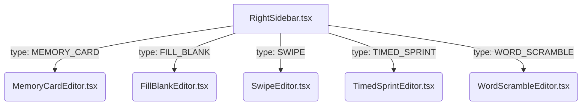

# Implementation Plan - Phase 2: Property Editors for New Slide Elements

This plan outlines the design and integration of properties editors for the five new interactive elements: **Memory Card**, **Fill in the Blank**, **Swipe**, **Timed Sprint**, and **Word Scramble**. This will allow authors to customize texts, time limits, and answer validation details directly within the builder's right sidebar.

---

## 1. Summary of Phase 1 Accomplishments

We successfully completed the core integration of the five interactive elements:
- **High-Fidelity Components**: Implemented custom visual components with immersive mechanics (card pairs shuffling, drag swiping with physics, countdown progress bars, text box verification, letter badges).
- **Registry & Showcase Integration**: Exported all components and initialized Slides 7 to 11 in `mock-slides.ts` representing high-fidelity test cases.
- **Visual Design Parity**: Aligned `ElementPreview` inside `element-preview.tsx` to render the actual components under a `pointer-events-none` wrapper, eliminating duplicate shrunken labels and providing 100% design-to-player styling consistency while saving 4 KB in bundle size.
- **Compilation & Linters**: Zero TypeScript or ESLint warnings/errors.

---

## 2. Proposed Changes for Phase 2: Property Editors

We will implement five custom editor sub-components inside the builder's sidebar folder (`src/pages/builder/ui/sidebar/`) and wire them into the main right sidebar control.



### [NEW] Properties Editor Sub-components

#### 1. [MemoryCardEditor.tsx](file:///d:/Dev/Work/previewer/src/pages/builder/ui/sidebar/MemoryCardEditor.tsx)
An editor to manage the matching deck:
- **Card Manager List**: A form showing current unique card items.
- **Controls**:
  - A text input for each card's matching value (`c.value`).
  - "Thêm thẻ" (Add Card) button to add a new card item (dynamically assigning unique IDs).
  - "Xóa" (Delete Card) button for each row.
- **Visual Style**:
  - Border radius editor.

#### 2. [FillBlankEditor.tsx](file:///d:/Dev/Work/previewer/src/pages/builder/ui/sidebar/FillBlankEditor.tsx)
An editor for fill-in-the-blank questions:
- **Inputs**:
  - **Question Text** (`question`): `TextArea` to input the main prompt.
  - **Correct Answer** (`correctAnswer`): `input[type="text"]` to specify the exact target string.
  - **Case Sensitive** (`caseSensitive`): A checkbox to toggle strict casing.
- **Visual Style**:
  - Border radius editor.

#### 3. [SwipeEditor.tsx](file:///d:/Dev/Work/previewer/src/pages/builder/ui/sidebar/SwipeEditor.tsx)
An editor for true/false swipe assertions:
- **Inputs**:
  - **Statement Text** (`statement`): `TextArea` to customize the card's assertion statement.
  - **Correct Direction** (`correctDirection`): Radio selectors or styled buttons to choose between:
    - `"right"` (Đúng - Swipe Right)
    - `"left"` (Sai - Swipe Left)
- **Visual Style**:
  - Border radius editor.

#### 4. [TimedSprintEditor.tsx](file:///d:/Dev/Work/previewer/src/pages/builder/ui/sidebar/TimedSprintEditor.tsx)
An editor for timed multiple-choice countdowns:
- **Inputs**:
  - **Question Text** (`question`): `TextArea` for the question.
  - **Duration** (`duration`): `NumberField` (seconds) to control timer duration.
  - **Options List** (`options`):
    - Add / Delete controls.
    - Radio selectors to pick the exact `correctId` from the options.
    - Text inputs for each choice's content.
- **Visual Style**:
  - Border radius editor.

#### 5. [WordScrambleEditor.tsx](file:///d:/Dev/Work/previewer/src/pages/builder/ui/sidebar/WordScrambleEditor.tsx)
An editor for word unscramble puzzles:
- **Inputs**:
  - **Correct Word** (`correctWord`): Text input for the solved state.
  - **Scrambled Word** (`scrambledWord`): Text input for the scrambled letter puzzle.
  - **Auto-Scramble Helper (Premium UX)**: A "Tự động đảo chữ" helper button that scrambles the value of `correctWord` and instantly sets it in `scrambledWord` using a random permutation algorithm.
- **Visual Style**:
  - Border radius editor.

---

### [MODIFY] [right-sidebar.tsx](file:///d:/Dev/Work/previewer/src/pages/builder/ui/right-sidebar.tsx)

Import the five new editors and insert switch render cases in the design sidebar tab:
```typescript
import { MemoryCardEditor } from "./sidebar/MemoryCardEditor"
import { FillBlankEditor } from "./sidebar/FillBlankEditor"
import { SwipeEditor } from "./sidebar/SwipeEditor"
import { TimedSprintEditor } from "./sidebar/TimedSprintEditor"
import { WordScrambleEditor } from "./sidebar/WordScrambleEditor"

// ... inside RightSidebar switch cases:
{selectedElement.type === "MEMORY_CARD" && (
  <MemoryCardEditor
    selectedElement={selectedElement}
    onUpdateData={onUpdateData}
    onUpdateStyle={onUpdateStyle}
  />
)}
{selectedElement.type === "FILL_BLANK" && (
  <FillBlankEditor
    selectedElement={selectedElement}
    onUpdateData={onUpdateData}
    onUpdateStyle={onUpdateStyle}
  />
)}
{selectedElement.type === "SWIPE" && (
  <SwipeEditor
    selectedElement={selectedElement}
    onUpdateData={onUpdateData}
    onUpdateStyle={onUpdateStyle}
  />
)}
{selectedElement.type === "TIMED_SPRINT" && (
  <TimedSprintEditor
    selectedElement={selectedElement}
    onUpdateData={onUpdateData}
    onUpdateStyle={onUpdateStyle}
  />
)}
{selectedElement.type === "WORD_SCRAMBLE" && (
  <WordScrambleEditor
    selectedElement={selectedElement}
    onUpdateData={onUpdateData}
    onUpdateStyle={onUpdateStyle}
  />
)}
```

---

## 3. Verification & Acceptance Criteria

### Automated Tests
- `npm.cmd run typecheck` passes with zero typescript compilation errors.
- `npm.cmd run lint` runs successfully with zero warnings and zero linter errors.
- `npm.cmd run build` successfully creates a production build folder.

### Manual Verification
- Selecting each element on the canvas correctly loads its custom properties editor in the right sidebar.
- Modifying questions, choices, timer limits, or correct answers is instantly saved in state (`onUpdateData` and `onUpdateStyle`).
- Any state update correctly triggers visual re-render of the high-fidelity component on the canvas.
